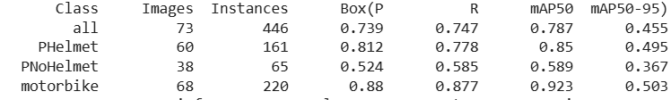
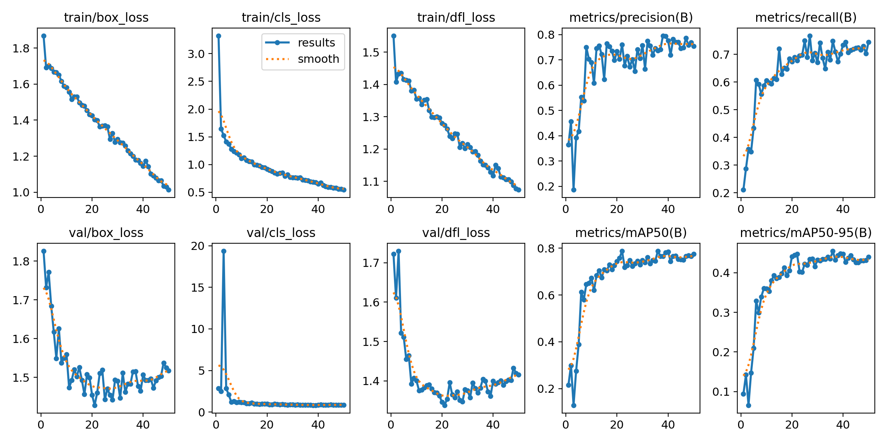
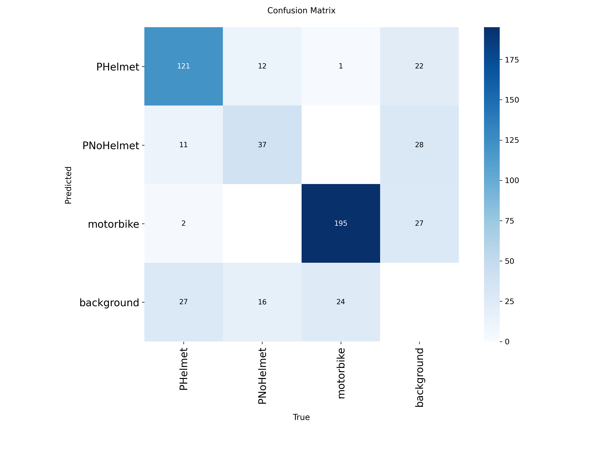
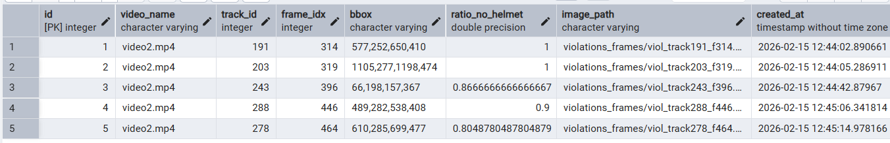
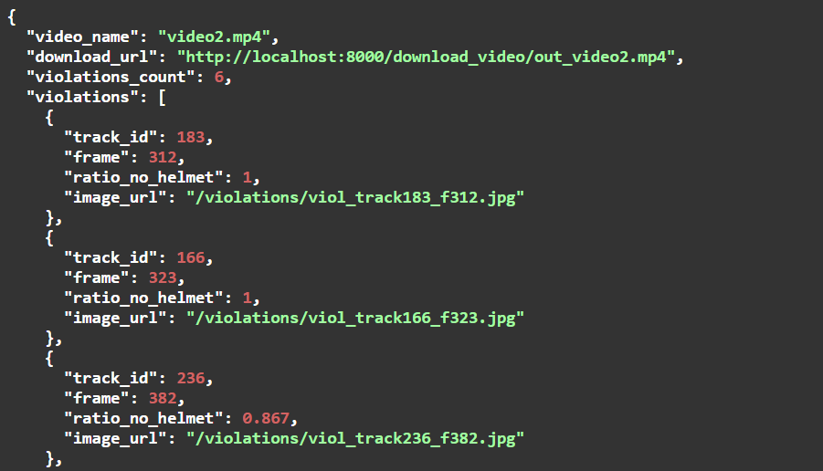
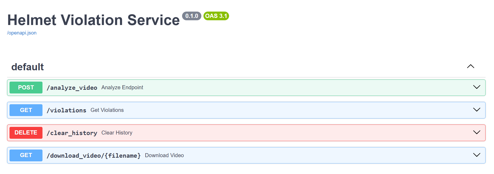

# Road Safety Helmet Detection System

Система автоматического обнаружения нарушений использования защитных шлемов участниками дорожного движения (мотоциклисты, велосипедисты). Построена на базе YOLOv8s, FastAPI и PostgreSQL с полной контейнеризацией через Docker. Модель обучена на данных с соревнования AI City Track.

### Основные возможности

- Детекция людей и шлемов с помощью кастомной YOLOv8 модели
- Трекинг объектов (ByteTrack) для отслеживания одного и того же человека
- Расчёт метрики нарушения: доля кадров без шлема
- Автоматическая запись нарушений в PostgreSQL
- Сохранение кадров с нарушениями
- REST API с интерактивной документацией (Swagger UI)
- Полная контейнеризация 

---

## Алгоритм работы

### Логика трекинга и детекции

1. **Детекция объектов (YOLOv8):**
   - На каждом кадре модель обнаруживает объекты и классифицирует их по классам.
   - Используется встроенный трекер BoT-SORT, который присваивает каждому объекту уникальный `track_id` и поддерживает его на протяжении всего видео.

2. **Классификация состояния:**
   - Для каждого `track_id` система накапливает статистику по каждому кадру:
     - сколько раз объект был распознан как «в шлеме».
     - сколько раз объект был распознан как «без шлема».

3. **Фильтрация шума:**
   - Анализируются только те объекты, которые были успешно отслежены на протяжении не менее 30 кадров видеопотока.
   - Таким образом отсеиваем краткие и случайные треки, уменьшая количество ложных срабатываний.

4. **Расчет метрики нарушения:**
   - Для каждого трека рассчитывается доля кадров без шлема:
     - `ratio_no_helmet = no_helmet_frames / (helmet_frames + no_helmet_frames)`.

5. **Принятие решения и сохранение:**
   - Если объект более 80% времени находится без шлема, трек считается нарушением.
   - Из текущего кадра сохраняется кроп с нарушителем.
   - В таблицу `violations` базы данных PostgreSQL записывается запись с полями:
     - `video_name`, `track_id`, `frame_idx`, `bbox`, `ratio_no_helmet`, `image_path`, `created_at`.

---

## Метрики

### Итоговые метрики по классам


### Графики обучения


### Матрица ошибок



### Структура таблицы `violations`

| Колонка          | Тип       | Описание                                                  |
| ---------------- | --------- | --------------------------------------------------------- |
| `id`             | Integer   | Первичный ключ                                            |
| `video_name`     | String    | Имя видеофайла                                            |
| `track_id`       | Integer   | ID трека объекта (уникален для каждого человека)         |
| `frame_idx`      | Integer   | Номер кадра, на котором зафиксировано нарушение          |
| `bbox`           | String    | Координаты bbox (формат: "x1,y1,x2,y2")                 |
| `ratio_no_helmet`| Float     | Доля кадров без шлема (0.0 = всегда в шлеме, 1.0 = никогда не был в шлеме) |
| `image_path`     | String    | Путь к сохранённому кадру                                 |
| `created_at`     | DateTime  | Время записи в БД                                         |

---

## Демонстрация работы

### Визуализация трекинга на видео


### Пример результата в базе данных



### Пример JSON-ответа API



---

## Установка и запуск

### Предварительные требования
- [Docker Desktop](https://www.docker.com/products/docker-desktop/) (Windows/Mac/Linux)
- (Опционально) [pgAdmin 4](https://www.pgadmin.org/) или другие удобные вам инструменты для управления БД.

### Установка и запуск

1. **Клонируйте репозиторий:**
   ```bash
   git clone https://github.com/EthernalSolitude/road-helmet-detection.git
   cd road_helmet_detecion
   ```

2. **Запустите контейнеры:**
   ```bash
   docker-compose up -d --build
   ```

3. **Проверьте статус:**
   Откройте **Docker Desktop** → вкладка **Containers**. Должны работать:
   - `helmet_app` (FastAPI сервис)
   - `helmet_db` (PostgreSQL база данных)

4. **Откройте API документацию:**
   Перейдите в браузере: [http://localhost:8000/docs](http://localhost:8000/docs)
---

## Структура проекта

```
helmet_detection_service/
├── app.py                  # Основной файл FastAPI приложения
├── models.py               # Модели SQLAlchemy (таблица violations)
├── best.pt                 # Обученная модель YOLOv8 (люди + шлемы)
├── Dockerfile              # Инструкция сборки образа
├── docker-compose.yml      # Оркестрация контейнеров
├── requirements.txt        # Python зависимости
├── videos/                 # Папка для входных видео
├── outputs/                # Папка для обработанных видео
└── violations_frames/      # Папка для сохранённых кадров нарушений
```

---

## Конфигурация

### Переменные окружения (docker-compose.yml)

| Переменная       | Значение по умолчанию                                    | Описание                |
| ---------------- | -------------------------------------------------------- | ----------------------- |
| `DATABASE_URL`   | `postgresql+psycopg://helmet_user:1234@db:5432/helmet_db` | Строка подключения к БД |

### Порты

| Сервис      | Внешний порт | Внутренний порт | Описание              |
| ----------- | ------------ | --------------- | --------------------- |
| `app`       | 8000         | 8000            | FastAPI веб-интерфейс |
| `db` (БД)   | 5433         | 5432            | PostgreSQL            |

**Примечание:** Порт 5433 выбран, чтобы не конфликтовать с локально установленным PostgreSQL (порт 5432).

---

## Работа с базой данных

### Подключение через pgAdmin

1. Откройте **pgAdmin 4**
2. **Создайте новый сервер** (ПКМ на Servers → Register → Server...)
3. **Заполните параметры:**

   **Вкладка "General":**
   - Name: `Docker Helmet DB`

   **Вкладка "Connection":**
   - Host name/address: `localhost`
   - Port: `5433`
   - Maintenance database: `helmet_db`
   - Username: `helmet_user`
   - Password: `1234`

4. Нажмите **Save**


## Использование API

### Эндпоинты



#### 1. `POST /process_video/`
Загружает видео и запускает анализ.

#### 2. `GET /violations/`
Получает список всех нарушений из базы данных.

#### 3. `DELETE /clear_history`
Очищает базу данных и папки с сохраненными видео и файлами.

#### 4. `GET /download_video/{filename}`
Скачивание результата.

---

### Как включить GPU:

1. **Откройте `Dockerfile`**
2. **Закомментируйте ВАРИАНТ 1 (CPU), раскомментируйте ВАРИАНТ 2:**
   ```dockerfile
   # ВАРИАНТ 1 (CPU ONLY):
   # RUN pip install --no-cache-dir torch torchvision torchaudio --index-url https://download.pytorch.org/whl/cpu && \
   #     pip install --no-cache-dir -r requirements.txt

   # ВАРИАНТ 2 (GPU SUPPORT):
   RUN pip install --no-cache-dir -r requirements.txt
   ```

3. **Откройте `docker-compose.yml`**
4. **Раскомментируйте секцию `deploy`:**
   ```yaml
   deploy:
     resources:
       reservations:
         devices:
           - driver: nvidia
             count: 1
             capabilities: [gpu]
   ```

5. **Пересоберите образ:**
   ```bash
   docker-compose down
   docker-compose up -d --build
   ```

## Ограничения системы

- **Метрика Recall для класса `PNoHelmet`:** Текущее значение Recall составляет ~0.59.
  - *Причина:* Сложный фон, блики, разнообразие ракурсов и недостаточное количество примеров в обучающей выборке (Imbalanced Dataset).
- **Ложные срабатывания:** Возможна путаница с похожими объектами (капюшоны, шапки) на большом расстоянии.
- **Производительность:** Обработка видео в высоком разрешении на CPU может быть медленной.

---

## 🚀 Планы по улучшению (Future Improvements)

- [ ] **Датасет:** Расширить датасет примерами людей без шлемов (Data Augmentation).
- [ ] **Hard Negative Mining:** Дообучить модель на сложных примерах (капюшоны, шапки), чтобы снизить ложные срабатывания.
- [ ] **Оптимизация:** Экспорт модели в TensorRT/ONNX для ускорения инференса.
- [ ] **Веб-интерфейс:** Разработать дашборд на React/Vue вместо Swagger UI.
- [ ] **Real-time обработка:** Поддержка RTSP-потоков через многопоточность (Celery/Redis).

