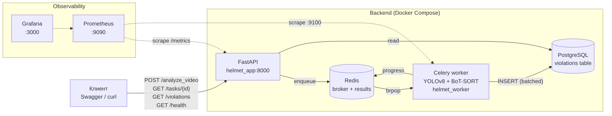
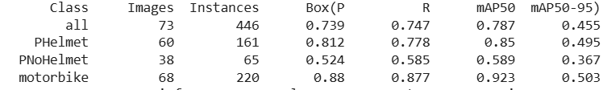
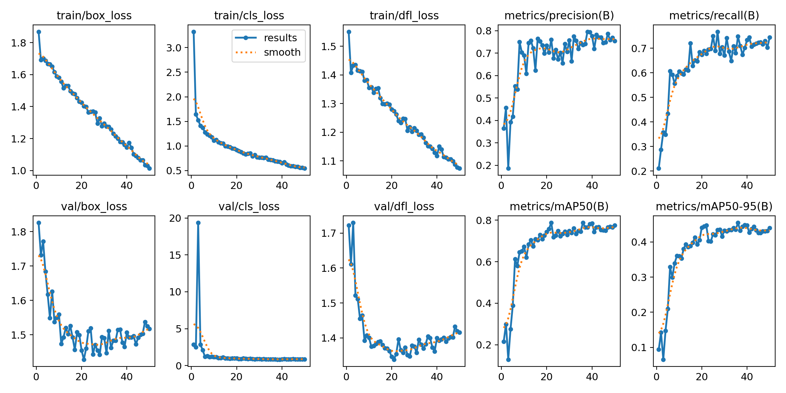
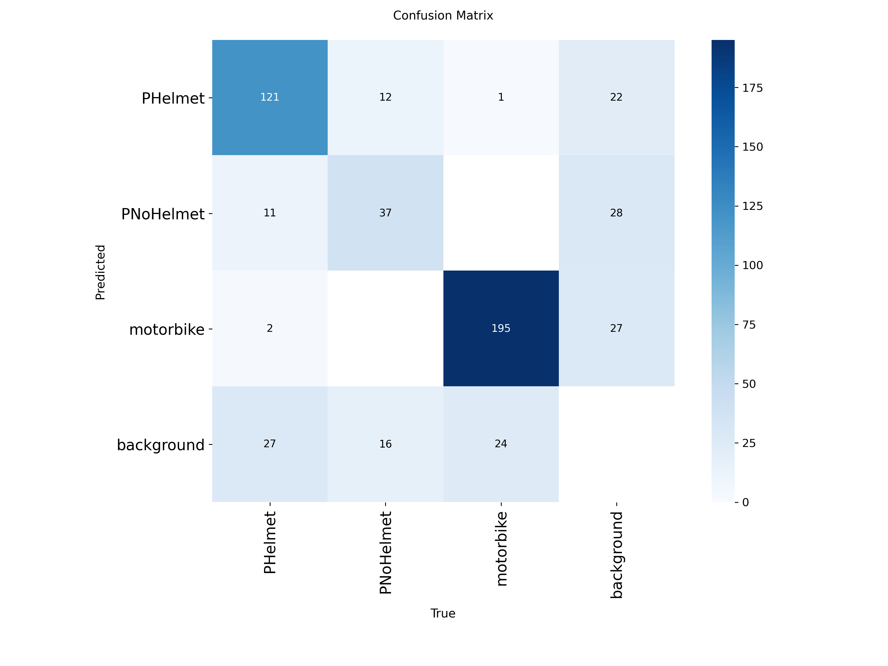
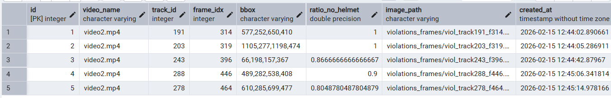
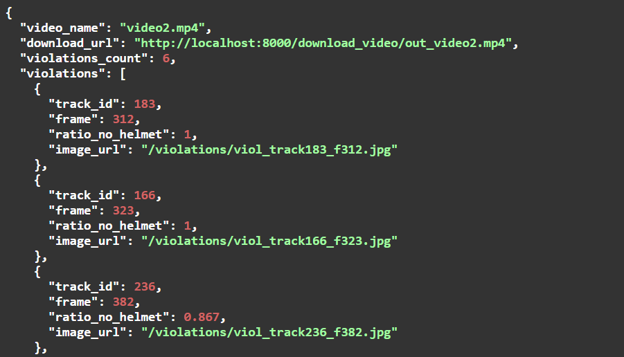
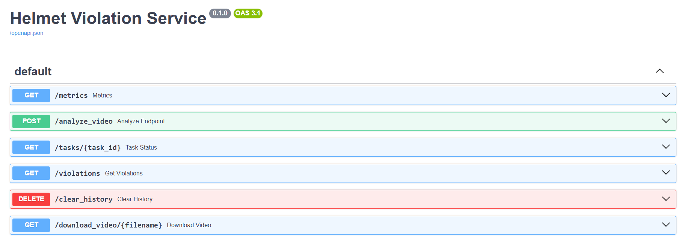

# Road Safety Helmet Detection System

[](https://github.com/EthernalSolitude/road-helmet-detection/actions/workflows/ci.yml)
[](https://codecov.io/gh/EthernalSolitude/road-helmet-detection)
[](https://github.com/EthernalSolitude/road-helmet-detection/pkgs/container/road-helmet-detection)
[](https://www.python.org/)
[](https://github.com/astral-sh/ruff)

Система автоматического обнаружения нарушений использования защитных шлемов участниками дорожного движения (мотоциклисты, велосипедисты). Построена на базе YOLOv8s, FastAPI и PostgreSQL с полной контейнеризацией через Docker. Обработка видео вынесена в асинхронные воркеры Celery (брокер Redis), а наблюдаемость обеспечивается связкой Prometheus + Grafana. Модель обучена на данных с соревнования AI City Track.

### Основные возможности

- Детекция людей и шлемов с помощью кастомной YOLOv8 модели
- Трекинг объектов (BoT-SORT с ReID) для отслеживания одного и того же человека
- Расчёт метрики нарушения: доля кадров без шлема
- Автоматическая запись нарушений в PostgreSQL
- Сохранение кадров с нарушениями
- REST API с интерактивной документацией (Swagger UI)
- **Асинхронная обработка** через Celery + Redis: API отвечает мгновенно, воркер обрабатывает видео в фоне, клиент поллит статус и прогресс
- **Мониторинг** через Prometheus + Grafana: готовый дашборд с метриками латентности инференса, FPS, частоты нарушений, времени обработки и HTTP-трафика
- Полная контейнеризация 

---

## Архитектура


```mermaid
flowchart LR
    Client["Клиент<br/>Swagger / curl"]

    subgraph Backend["Backend (Docker Compose)"]
        API["FastAPI<br/>helmet_app:8000"]
        Worker["Celery worker<br/>YOLOv8 + BoT-SORT<br/>helmet_worker"]
        Redis[("Redis<br/>broker + results")]
        Postgres[("PostgreSQL<br/>violations table")]
    end

    subgraph Observability["Observability"]
        Prom["Prometheus<br/>:9090"]
        Grafana["Grafana<br/>:3000"]
    end

    Client -->|"POST /analyze_video<br/>GET /tasks/{id}<br/>GET /violations<br/>GET /health"| API

    API -->|"enqueue"| Redis
    Redis -->|"brpop"| Worker
    Worker -->|"progress"| Redis
    Worker -->|"INSERT (batched)"| Postgres
    API -->|"read"| Postgres

    Prom -.->|"scrape /metrics"| API
    Prom -.->|"scrape :9100"| Worker
    Grafana -.-> Prom
```

**Поток данных:**
1. Клиент шлёт видео в `POST /analyze_video` → API сохраняет файл, кладёт задачу в Redis, возвращает `task_id` за миллисекунды
2. Celery-воркер забирает задачу из Redis, прогоняет YOLOv8 + BoT-SORT-трекинг, батчем коммитит нарушения в Postgres
3. Каждые 30 кадров воркер пишет прогресс обратно в Redis – клиент опрашивает `/tasks/{id}` и видит `current/total`
4. Prometheus каждые 10 сек скрейпит `/metrics` с обоих сервисов; Grafana визуализирует latency инференса, FPS, частоту нарушений

---

## Алгоритм работы

### Логика трекинга и детекции

1. **Детекция объектов (YOLOv8):**
   - На каждом кадре модель обнаруживает объекты и классифицирует их по классам.
   - Используется встроенный трекер BoT-SORT. Благодаря встроенному алгоритму ReID (визуальным признакам) трекер не теряет быстрые обьекты даже при пропуске кадров.

2. **Классификация состояния:**
   - Для каждого `track_id` система накапливает статистику по каждому кадру:
     - сколько раз объект был распознан как «в шлеме».
     - сколько раз объект был распознан как «без шлема».

3. **Фильтрация шума:**
   - Анализируются только те объекты, которые были успешно отслежены на протяжении не менее 15 кадров видеопотока.
   - Таким образом отсеиваем краткие и случайные треки, уменьшая количество ложных срабатываний.

4. **Расчет метрики нарушения:**
   - Для каждого трека рассчитывается доля кадров без шлема:
     - `ratio_no_helmet = no_helmet_frames / (helmet_frames + no_helmet_frames)`.

5. **Принятие решения и сохранение:**
   - Если объект более 80% времени находится без шлема, трек считается нарушением.
   - Из текущего кадра сохраняется кроп с нарушителем.
   - В таблицу `violations` базы данных PostgreSQL записывается запись с полями:
     - `video_name`, `track_id`, `frame_idx`, `bbox`, `ratio_no_helmet`, `image_path`, `created_at`.
     - 
6. **Оптимизация производительности (Frame Skipping):**
   - Для снижения вычислительной нагрузки и ускорения инференса в ~2 раза система обрабатывает только каждый второй кадр видеопотока.

7. **Асинхронная обработка:**
   - `POST /analyze_video` мгновенно ставит задачу в очередь Redis и возвращает `task_id`.
   - Celery-воркер разбирает очередь и выполняет инференс в фоне, публикуя прогресс (`PROGRESS → SUCCESS/FAILURE`).
   - Модель YOLO грузится один раз на процесс воркера (в хуке `worker_process_init`), что исключает переинициализацию на каждый запрос.
   - Нарушения пишутся в БД батчами (commit на каждые 10 записей), это снижает количество round-trip'ов в PostgreSQL.

---

## Метрики

### Итоговые метрики по классам


### Графики обучения


### Матрица ошибок



### Структура таблицы `violations`

| Колонка          | Тип       | Описание                                                  |
| ---------------- | --------- | --------------------------------------------------------- |
| `id`             | Integer   | Первичный ключ                                            |
| `video_name`     | String    | Имя видеофайла                                            |
| `track_id`       | Integer   | ID трека объекта (уникален для каждого человека)         |
| `frame_idx`      | Integer   | Номер кадра, на котором зафиксировано нарушение          |
| `bbox`           | String    | Координаты bbox (формат: "x1,y1,x2,y2")                 |
| `ratio_no_helmet`| Float     | Доля кадров без шлема (0.0 = всегда в шлеме, 1.0 = никогда не был в шлеме) |
| `image_path`     | String    | Путь к сохранённому кадру                                 |
| `created_at`     | DateTime  | Время записи в БД                                         |

---

## Демонстрация работы

### Визуализация трекинга на видео


### Пример результата в базе данных



### Пример JSON-ответа API



---

## Установка и запуск

### Предварительные требования
- [Docker Desktop](https://www.docker.com/products/docker-desktop/) (Windows/Mac/Linux)
- (Опционально) [pgAdmin 4](https://www.pgadmin.org/) или другие удобные вам инструменты для управления БД.

### Установка и запуск

1. **Клонируйте репозиторий:**
   ```bash
   git clone https://github.com/EthernalSolitude/road-helmet-detection.git
   cd road-helmet-detecion
   ```

2. **Запустите контейнеры:**
   ```bash
   docker-compose up -d --build
   ```

   > Готовый образ публикуется автоматически в GHCR на каждый merge в `main`:
   > ```bash
   > docker pull ghcr.io/ethernalsolitude/road-helmet-detection:latest
   > ```

3. **Проверьте статус:**
   Откройте **Docker Desktop** и перейдите во вкладку **Containers**. Должны работать:
   - `helmet_app` – FastAPI сервис
   - `helmet_worker` – Celery-воркер, обрабатывающий видео
   - `helmet_redis` – брокер очереди и result backend
   - `helmet_db` – PostgreSQL база данных
   - `helmet_prometheus` – сбор метрик
   - `helmet_grafana` – визуализация метрик
   - `helmet_jaeger` – distributed tracing (OpenTelemetry)

4. **Откройте сервисы в браузере:**
   - API документация (Swagger): [http://localhost:8000/docs](http://localhost:8000/docs)
   - Grafana (логин/пароль `admin`/`admin`): [http://localhost:3000](http://localhost:3000) → Dashboards → **Helmet Detection Service**
   - Prometheus (таргеты и PromQL): [http://localhost:9090](http://localhost:9090)
   - Jaeger UI (трейсы): [http://localhost:16686](http://localhost:16686)

---

## Структура проекта

```
helmet_detection_service/
├── config.py               # Конфигурационый файл (параметры модели, пути, Redis/Celery)
├── app.py                  # FastAPI: ручки /analyze_video, /tasks/{id}, /violations, /metrics
├── models.py               # Модели SQLAlchemy (таблица violations)
├── detection.py            # Логика детекции, трекинга и эмиссии метрик
├── celery_app.py           # Конфигурация Celery, warmup модели после fork, /metrics воркера
├── tasks.py                # Celery-задача analyze_video_task (прогресс + результат)
├── metrics.py              # Prometheus-метрики (гистограммы, counters, gauge)
├── best.pt                 # Обученная модель YOLOv8s
├── Dockerfile              # Инструкция сборки образа
├── docker-compose.yml      # Оркестрация контейнеров (app, worker, redis, db, prometheus, grafana, jaeger)
├── requirements.txt        # Python зависимости
├── prometheus/
│   └── prometheus.yml      # Скрейп-конфиг (таргеты app:8000 и worker:9100)
├── grafana/
│   └── provisioning/       # Автопровижн датасорса и дашборда
│       ├── datasources/
│       └── dashboards/
├── videos/                 # Папка для входных видео
├── outputs/                # Папка для обработанных видео
└── violations_frames/      # Папка для сохранённых кадров нарушений
```

---

## Конфигурация

### Переменные окружения (docker-compose.yml)

| Переменная       | Значение по умолчанию                                      | Описание                                |
| ---------------- | ---------------------------------------------------------- | --------------------------------------- |
| `DATABASE_URL`   | `postgresql+psycopg://helmet_user:1234@db:5432/helmet_db`  | Строка подключения к БД                 |
| `REDIS_URL`      | `redis://redis:6379/0`                                     | Брокер Celery + result backend          |

### Порты

| Сервис       | Внешний порт | Внутренний порт | Описание                            |
| ------------ | ------------ | --------------- | ----------------------------------- |
| `app`        | 8000         | 8000            | FastAPI + `/metrics`                |
| `worker`     | 9100         | 9100            | `/metrics` Celery-воркера           |
| `redis`      | 6379         | 6379            | Брокер очереди                      |
| `db`         | 5433         | 5432            | PostgreSQL                          |
| `prometheus` | 9090         | 9090            | Prometheus UI / PromQL              |
| `grafana`    | 3000         | 3000            | Grafana (логин/пароль `admin`/`admin`) |
| `jaeger`     | 16686        | 16686           | Jaeger UI (трейсы)                  |
| `jaeger`     | 4318         | 4318            | OTLP/HTTP receiver для трейсов      |

**Примечание:** Порт 5433 выбран, чтобы не конфликтовать с локально установленным PostgreSQL (порт 5432).

---

## Работа с базой данных

### Подключение через pgAdmin

1. Откройте **pgAdmin 4**
2. **Создайте новый сервер** (ПКМ на Servers → Register → Server...)
3. **Заполните параметры:**

   **Вкладка "General":**
   - Name: `Docker Helmet DB`

   **Вкладка "Connection":**
   - Host name/address: `localhost`
   - Port: `5433`
   - Maintenance database: `helmet_db`
   - Username: `helmet_user`
   - Password: `1234`

4. Нажмите **Save**


## Использование API

### Эндпоинты



#### 1. `POST /analyze_video`
Принимает видеофайл, ставит задачу в очередь Celery и **сразу** возвращает `task_id` (HTTP 202). Пример ответа:
```json
{
  "task_id": "a1b2c3...",
  "status_url": "/tasks/a1b2c3...",
  "video_name": "video2.mp4"
}
```

#### 2. `GET /tasks/{task_id}`
Статус задачи. Возможные состояния:
- `PENDING` – задача в очереди, воркер ещё не взял
- `PROGRESS` – идёт обработка; поле `progress` содержит `{"current": <кадр>, "total": <всего кадров>}`
- `SUCCESS` – готово; в `result` лежат `violations`, `download_url`, `violations_count`, `frames_processed`
- `FAILURE` – упало; в `error` текст ошибки

#### 3. `GET /violations`
Получает список последних 50 нарушений из базы данных.

#### 4. `DELETE /clear_history`
Очищает базу данных и папки с сохранёнными видео и файлами.

#### 5. `GET /download_video/{filename}`
Скачивание размеченного видео (имя формируется как `out_<original_name>`).

#### 6. `GET /metrics`
Метрики FastAPI в формате Prometheus (HTTP RPS, latency, размеры запросов/ответов + кастомные `helmet_*`). Основной источник данных для дашборда – аналогичный эндпоинт воркера на `:9100/metrics`.

---

## Мониторинг (Prometheus + Grafana)

Prometheus скрейпит два таргета: `app:8000` (HTTP-метрики + кастомные) и `worker:9100` (метрики инференса). Дашборд Grafana автоматически провижнится из `grafana/provisioning/` при старте контейнера.

### Кастомные метрики

| Метрика                               | Тип        | Описание                                       |
| ------------------------------------- | ---------- | ---------------------------------------------- |
| `helmet_inference_seconds`            | Histogram  | Время инференса модели на один кадр            |
| `helmet_video_processing_seconds`     | Histogram  | Полное время обработки одного видео            |
| `helmet_frames_processed_total`       | Counter    | Суммарное количество обработанных кадров       |
| `helmet_frames_skipped_total`         | Counter    | Кадры, пропущенные по `frame_skip`             |
| `helmet_violations_detected_total`    | Counter    | Зафиксированные нарушения                      |
| `helmet_videos_processed_total`       | Counter    | Обработанные видео, лейбл `status=success/error` |
| `helmet_active_video_tasks`           | Gauge      | Количество видео в обработке прямо сейчас      |

### Панели дашборда

- Активные задачи, суммарные счётчики нарушений и видео за период
- Latency инференса p50 / p95 / p99 на кадр
- FPS обработки (processed vs skipped)
- Частота новых нарушений
- Время обработки видео p50 / p95
- HTTP RPS и p95 latency по хендлерам

Чтобы увидеть значения под нагрузкой – залей видео через `POST /analyze_video` и смотри, как оживают панели в Grafana по адресу [http://localhost:3000](http://localhost:3000).

---

## Оптимизация инференса через ONNX Runtime

В качестве рантайма инференса можно использовать ONNX Runtime вместо PyTorch – это даёт ускорение по latency на одном кадре без потери точности (модель та же, меняется только бэкенд).

**Включение** через переменную окружения:

```yaml
# в docker-compose.yml – секция worker.environment
- MODEL_PATH=best.onnx
```

При первом запуске воркера, если файла `best.onnx` ещё нет, он автоматически экспортируется из `best.pt` через `ultralytics.YOLO.export(format="onnx")`. Дальше используется как обычно – трекинг BoT-SORT тоже работает с ONNX-моделью.

**Замер выигрыша** на одном кадре (50 прогонов после прогрева):

```bash
python scripts/benchmark_inference.py videos/your_video.mp4 --frames 50
```

Скрипт прогоняет одну и ту же модель в обоих форматах и печатает p50 / p95 / mean / fps + итоговое ускорение. Результат можно сравнить с панелью «Latency инференса на кадр» в Grafana, чтобы увидеть эффект на реальном пайплайне.

---

### Как включить GPU:

1. **Откройте `Dockerfile`**
2. **Закомментируйте ВАРИАНТ 1 (CPU), раскомментируйте ВАРИАНТ 2:**
   ```dockerfile
   # ВАРИАНТ 1 (CPU ONLY):
   # RUN pip install --no-cache-dir torch torchvision torchaudio --index-url https://download.pytorch.org/whl/cpu && \
   #     pip install --no-cache-dir -r requirements.txt

   # ВАРИАНТ 2 (GPU SUPPORT):
   RUN pip install --no-cache-dir -r requirements.txt
   ```

3. **Откройте `docker-compose.yml`**
4. **Раскомментируйте секцию `deploy`:**
   ```yaml
   deploy:
     resources:
       reservations:
         devices:
           - driver: nvidia
             count: 1
             capabilities: [gpu]
   ```

5. **Пересоберите образ:**
   ```bash
   docker-compose down
   docker-compose up -d --build
   ```

### Текущие ограничения системы

- **Метрика полноты (Recall) для класса `PNoHelmet`:** 
  Текущее значение составляет ~0.59. 
  Это связано с дисбалансом классов в исходном датасете, сложном фоном, бликами и разнообразием ракурсов съемки.

- **Ложные срабатывания:** 
  На большом расстоянии или при плохом освещении возможна путаница с визуально похожими объектами.

- **Производительность инференса:** 
  Несмотря на внедренную оптимизацию (Frame Skipping), обработка видео в высоком разрешении без использования GPU остается вычислительно тяжелой задачей.

---

### Планы по улучшению 

- **Улучшение качества детекции:**
  Расширить датасет примерами сложных ситуаций (люди в капюшонах, кепках, шапках) и дообучить модель, чтобы минимизировать ложные срабатывания.

- **Оптимизация инференса:**
  Экспорт весов модели в форматы TensorRT или ONNX для дополнительного аппаратного ускорения инференса на GPU/CPU.

- **Полноценный Веб-интерфейс:**
  Разработка дашборда на React или Vue для визуализации аналитики и истории нарушений.

- **Real-time обработка (RTSP-потоки):**
  Добавление поддержки обработки видеопотоков в реальном времени с IP-камер.

- **Алертинг и SLO:**
  На основе собранных в Prometheus метрик настроить алерты (резкий рост `helmet_inference_seconds`, падение таргетов, очередь задач растёт быстрее, чем расходуется).

- **Горизонтальное масштабирование воркеров:**
  `docker compose up --scale worker=N` для параллельной обработки нескольких видео, с отдельным пробросом `/metrics` через service discovery.


